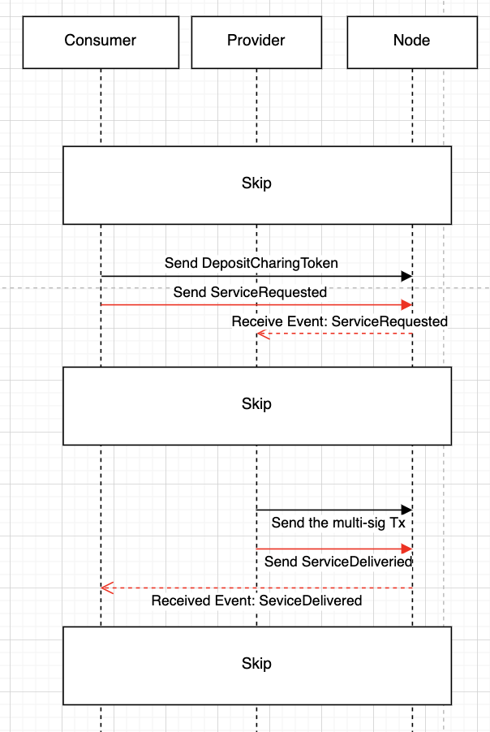

# Peaq Pallet Transaction

#### Introduction
The Peaq-Transaction smart contract is a message bridge to allow the provider/consumer to get their interesting event. After receiving the event, the consumer/provider can do other actions based on the event information.

There are two scenarios here.
1. The consumer sends the Extrinsic, service_requested, and the provider will check whether this event is for him. If so, the provider will use the information to check whether the balance is enough and start to charge.
2. The provider sends the service_delivered Extrinsic, and when the target user gets the event, he'll do further operations, for example, approving the multi-sig transaction.

In the future, we'll add types of message bridge between the provider and consumer to our system.



#### Installation
* Import the pallet dependecies by adding below snippets to your `runtime/src/Cargo.toml` file.
```
# --snip--

[dependencies.peaq-pallet-transaction]
default-features = false
git = 'https://github.com/peaqnetwork/peaq-pallet-transaction.git'
version = '0.0.1'

# --snip--

[features]
default = ['std']
runtime-benchmarks = [
  # --snip--
  'peaq-pallet-transaction/runtime-benchmarks',
]
std = [
  'peaq-pallet-transaction/std',
  # --snip--
]
```

* Implement peaq transaction pallet on your runtime by adding below snippets to `runtime/src/lib.rs` file.
```
# --snip--

pub use peaq_pallet_transaction;

# --snip--

/// Config the transaction in pallets/transaction
impl peaq_pallet_transaction::Config for Runtime {
    type Event = Event;
    type Currency = Balances;
}
```

* Add PeaqTransaction parameter type to the runtime construct on your `runtime/src/lib.rs` file using below snippet.
```
# --snip--
PeaqTransaction: peaq_pallet_transaction::{Pallet, Call, Storage, Event<T>},
# --snip--
```

### Usage
* After installation, build your node
* Run and connect your node to Polkadorjs App
* Check for `PeaqTransaction` under `developer - Extrinsics` tab.

### Implementation:
In this pallet, we support two Extrinsics for commmunication:

#### service_requested
The consumer uses this Extrinsic to send the message which contains provider's PK and deposited token.

#### service_delivered
The provider sends the refund/spent information (token number, transaction hash, multisig transaction's time point and call hash) and the consumer PK by this Extrinsic.


## License

[Apache-2.0](https://choosealicense.com/licenses/apache-2.0/)
